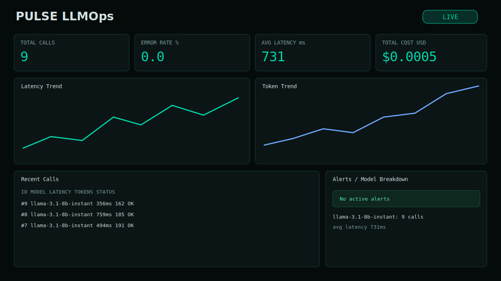
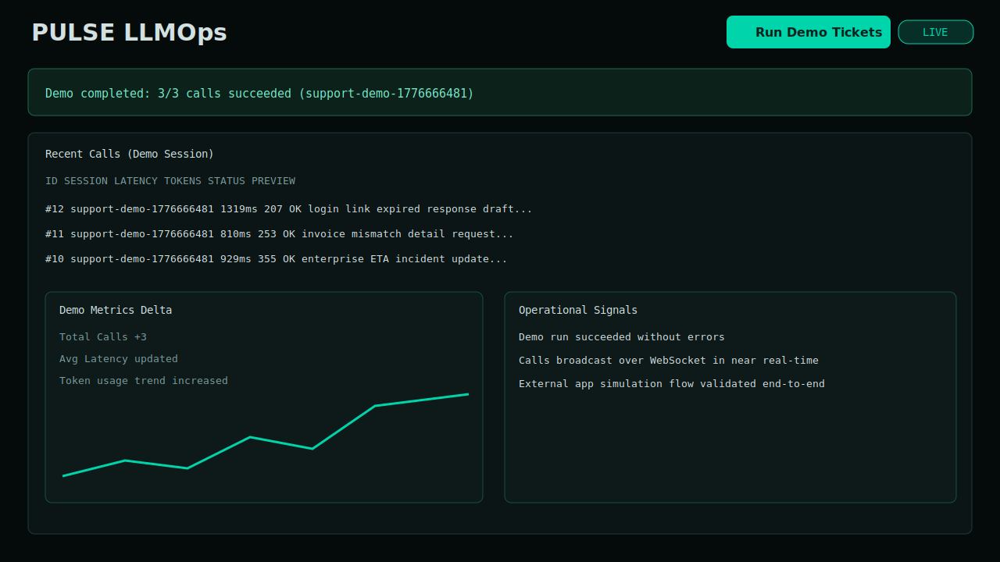
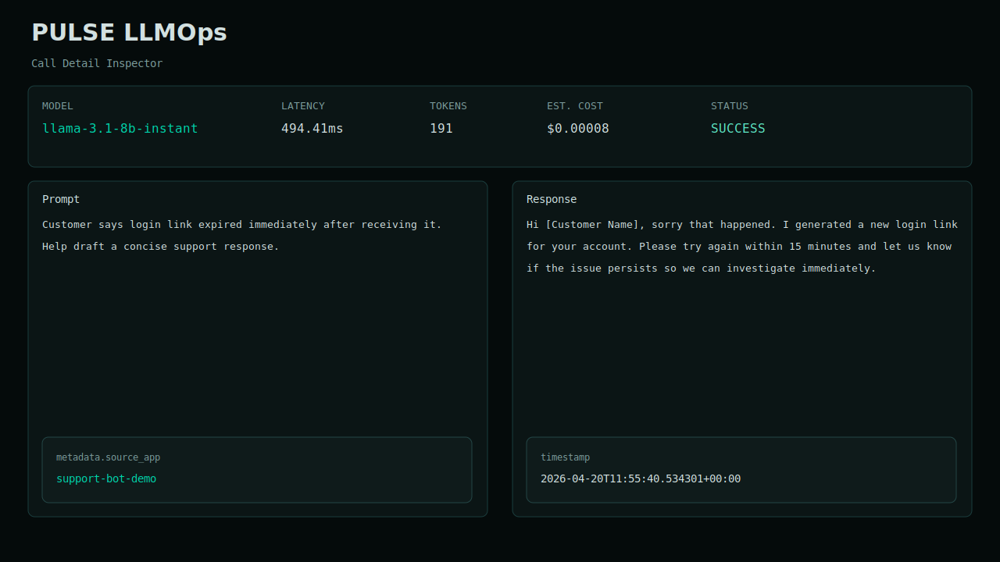

<div align="center">

# 📊 PULSE LLMOps

### Production-Ready LLM Observability Dashboard — Track Latency, Cost, Tokens, Errors, and Live Call Streams

[](https://www.python.org/)
[](https://fastapi.tiangolo.com/)
[](https://react.dev/)
[](https://recharts.org/en-US/)
[](https://groq.com/)
[](https://www.docker.com/)
[](https://github.com/features/actions)

<br/>

> **PULSE LLMOps** is a full-stack observability platform for AI workloads. It captures every LLM call (live playground calls or tracked external app traffic), computes latency/token/cost/error metrics, stores full request-response traces, streams updates over WebSockets, and visualizes operations in a real-time dashboard.

<br/>

  

</div>

---

## 📋 Table of Contents

- [Overview](#-overview)
- [Application Preview](#-application-preview)
- [Features](#-features)
- [Architecture](#-architecture)
- [Tech Stack](#-tech-stack)
- [Project Structure](#-project-structure)
- [Installation](#-installation)
- [Usage](#-usage)
- [Example App Demonstration](#-example-app-demonstration)
- [API Reference](#-api-reference)
- [Configuration](#-configuration)
- [Testing](#-testing)
- [Security Notes](#-security-notes)

---

## 🧠 Overview

PULSE is built for teams shipping AI features who need to answer operational questions quickly:

- Why are responses getting slower?
- Which model is costing more?
- How often are calls failing?
- Which sessions had poor prompt quality or high hallucination risk?

Instead of treating AI calls as opaque events, PULSE turns them into structured telemetry. Every call is persisted, scored, aggregated, and surfaced in a dense operations dashboard.

---

## 🖼️ Application Preview

<div align="center">

### Dashboard Overview


### One-Click Demo Run


### Call Detail Inspector


</div>

---

## ✨ Features

| Feature | Description |
|---|---|
| 📈 **Live KPI Dashboard** | Total calls, error rate, average latency, and estimated cost in real time |
| 📊 **Timeseries Charts** | Latency and token trends from persisted call history |
| 🧾 **Call Trace Log** | Prompt, response, model, status, latency, and token details per call |
| 🚨 **Alert Engine** | Threshold alerts for latency spikes, failures, and accumulated cost |
| ▶️ **Playground Calls** | Run direct model prompts from API and track as first-class telemetry |
| 🔌 **External App Tracking** | Any app can send telemetry to `POST /track` |
| 🧪 **One-Click Demo Tickets** | Dashboard button runs a realistic support-ticket workload |
| 🔐 **Phase-2 Security** | API-key auth + per-IP in-memory rate limiting |
| 🐳 **Deployment Ready** | Dockerfiles + `docker-compose.yml` included |
| ✅ **CI Pipeline** | GitHub Actions runs backend tests and frontend production build |

---

## 🏗️ Architecture

```text
┌─────────────────────────────────────────────────────────────┐
│                      React Dashboard                        │
│   KPI cards • charts • recent calls • alerts • demo run    │
└───────────────┬─────────────────────────────────────────────┘
                │ HTTP + WebSocket
┌───────────────▼─────────────────────────────────────────────┐
│                      FastAPI Backend                        │
│                                                             │
│  /track         ingest external app telemetry               │
│  /playground    run tracked Groq calls                      │
│  /demo/run-support  run 3 realistic support demo tickets    │
│  /metrics/*     summary, timeseries, model breakdown        │
│  /calls, /alerts persisted observability records            │
│  /ws            live broadcast on new calls + alerts        │
└───────────────┬─────────────────────────────────────────────┘
                │
      ┌─────────▼─────────┐          ┌────────────────────────┐
      │ SQLite + aiosqlite│          │ Groq API (LLM provider)│
      │ calls + alerts    │          │ llama-3.1-8b-instant   │
      └───────────────────┘          └────────────────────────┘
```

---

## 🛠️ Tech Stack

| Layer | Technology |
|---|---|
| **Frontend** | React 18, React Scripts, Recharts, Axios |
| **Backend** | FastAPI, Uvicorn, Pydantic, aiosqlite |
| **LLM Provider** | Groq Python SDK (`groq`) |
| **Realtime** | FastAPI WebSockets |
| **Storage** | SQLite (`pulse.db`) |
| **Security** | API key middleware + in-memory rate limiter |
| **DevOps** | Docker, Docker Compose, GitHub Actions |
| **Testing** | Pytest |

---

## 📁 Project Structure

```text
pulse-llmops/
├── backend/
│   ├── main.py
│   ├── groq_service.py
│   ├── database.py
│   ├── alert_engine.py
│   ├── analyzer.py
│   ├── rate_limiter.py
│   ├── schemas.py
│   ├── settings.py
│   ├── tests/test_api.py
│   ├── requirements.txt
│   ├── Dockerfile
│   └── .env.example
├── frontend/
│   ├── src/pages/DashboardPage.jsx
│   ├── src/services/api.js
│   ├── src/styles/globals.css
│   ├── Dockerfile
│   └── package.json
├── examples/
│   └── support_bot_demo.py
├── .github/workflows/ci.yml
├── docker-compose.yml
└── README.md
```

---

## 🚀 Installation

### Prerequisites
- Python 3.12+
- Node.js 18+
- Groq API key

### Backend
```bash
cd backend
python -m venv venv
venv\Scripts\activate
pip install -r requirements.txt
copy .env.example .env
uvicorn main:app --reload --host 0.0.0.0 --port 8000
```

### Frontend
```bash
cd frontend
npm install
npm start
```

### Local URLs
- Dashboard: `http://localhost:3000`
- API: `http://localhost:8000`
- Swagger: `http://localhost:8000/docs`
- Health: `http://localhost:8000/health`

---

## 💻 Usage

### 1) Track external app calls
Send your app’s call telemetry to:
- `POST /track`

### 2) Use integrated playground
Run model prompts via:
- `POST /playground`

### 3) Observe live dashboard
Watch KPI/cards/charts/calls update automatically via:
- polling + WebSocket events from `/ws`

### 4) Run one-click demo from UI
Click **Run Demo Tickets** in the dashboard header to simulate a support workflow and track 3 fresh calls end-to-end.

---

## 🧪 Example App Demonstration

PULSE includes a realistic external app simulator:
- `examples/support_bot_demo.py`

It:
1. Calls Groq for support-ticket replies.
2. Sends each call to `POST /track`.
3. Lets you verify full ingestion in dashboard and `GET /calls`.

Run:
```powershell
$env:GROQ_API_KEY="your_groq_key"
$env:PULSE_URL="http://localhost:8000"
python .\examples\support_bot_demo.py
```

---

## 🔌 API Reference

| Method | Endpoint | Description |
|---|---|---|
| `GET` | `/health` | Health status |
| `GET` | `/metrics/summary` | Aggregate KPIs |
| `GET` | `/metrics/timeseries?hours=24` | Time bucket metrics |
| `GET` | `/metrics/models` | Per-model aggregates |
| `GET` | `/calls?limit=50&offset=0` | Recent call records |
| `GET` | `/calls/{call_id}` | Single call detail |
| `GET` | `/alerts` | Active alerts |
| `POST` | `/track` | Ingest external call telemetry |
| `POST` | `/playground` | Run a tracked Groq call |
| `POST` | `/demo/run-support` | Execute built-in support demo workload |
| `WS` | `/ws` | Live event stream |

---

## ⚙️ Configuration

Set in `backend/.env`:

```bash
GROQ_API_KEY=your_groq_api_key_here
API_KEY=
APP_ENV=development
DB_PATH=./pulse.db
ALLOW_CORS_ORIGINS=http://localhost:3000
RATE_LIMIT_PER_MINUTE=120
COST_PER_1K_INPUT_TOKENS=0.00015
COST_PER_1K_OUTPUT_TOKENS=0.0006
LATENCY_ALERT_MS=5000
ERROR_RATE_ALERT_PCT=10
DAILY_COST_ALERT_USD=1.0
```

---

## 🧪 Testing

```bash
# Backend tests
cd backend
venv\Scripts\python -m pytest -q

# Frontend production build
cd ../frontend
npm run build
```

---

## ☁️ Deployment

- Backend (Render): use `render.yaml` at repo root and set `GROQ_API_KEY` / `API_KEY` in Render secrets.
- Frontend (Vercel): deploy `frontend/` and set:
  - `REACT_APP_API_URL=https://<your-render-backend>.onrender.com`
  - `REACT_APP_WS_URL=wss://<your-render-backend>.onrender.com/ws`

---

## 🔒 Security Notes

- Never commit real API keys.
- Restrict CORS origins before public deployment.
- Replace SQLite with Postgres for multi-user production load.
- Add key rotation and secret storage via deployment platform secrets.

---

<div align="center">

Built for teams that want AI features with production-grade visibility.

</div>
